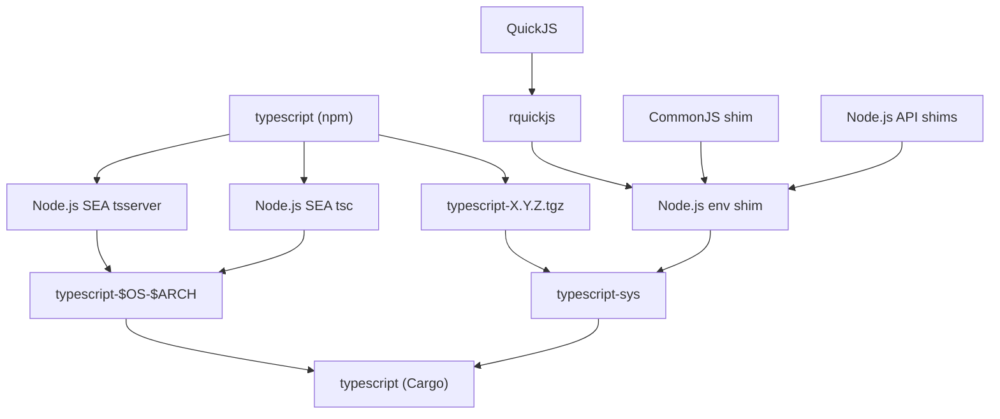

# typescript-rs
🟦 TypeScript project exposed to Rust

## How it works

1. We grab the `typescript-X.Y.Z.tgz` tarball from the npm registry. This is the actual TypeScript project code.
2. In typescript-sys, we wrap the tarball from npm in a minimal Node.js-like CommonJS-like environment using QuickJS via rquickjs.
3. We expose 

## Development
